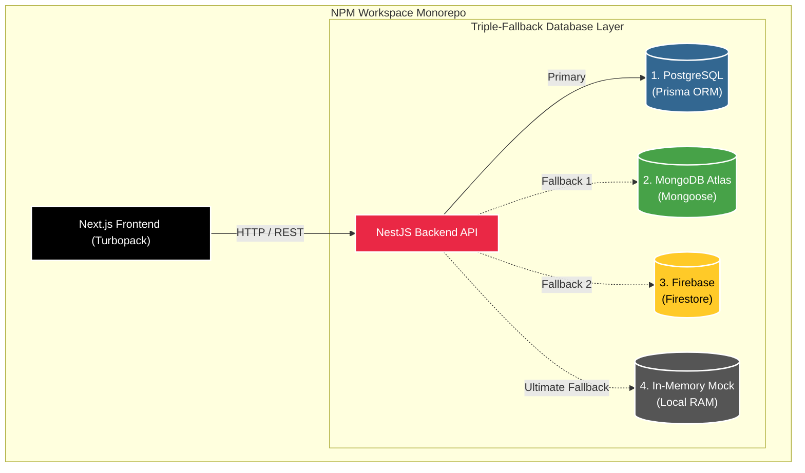

<h1 align="center">
  <a href="https://git.io/typing-svg">
    
  </a>
</h1>

<p align="center">
  
</p>

<p align="center">
  
  
  
  
</p>

<p align="center">
  <a href="#">
    
  </a>
</p>

<p align="center">
  
</p>

Welcome  to **ResumeAI Pro**—not just another resume builder, but a fully-fledged, AI-driven **Career Intelligence System**. 

Built with an enterprise-grade NPM Workspace Monorepo architecture (Next.js Frontend + NestJS Backend), this platform fundamentally changes how candidates optimize their profiles for the modern job market. We've bypassed the generic templates of the past and engineered an **ATS 2.0 Engine** that simulates real-world Applicant Tracking Systems to ensure maximum visibility for job seekers.

---

##  System Boot Sequence

> **Welcome to the God-Tier Terminal.** Our architecture is designed to literally survive the apocalypse. Here is what happens when the ecosystem boots up locally:

```console
$ resume-ai-pro start --mode=god-tier

[SYSTEM] Initializing Triple-Fallback Database Router...
[SYSTEM] Connection 1: PostgreSQL (Prisma) -> FAILED (Server Unreachable)
[SYSTEM] Connection 2: MongoDB Atlas       -> FAILED (IP Whitelist Rejected)
[SYSTEM] Connection 3: Firebase Firestore  -> FAILED (Project Not Initialized)
[SYSTEM] Connection 4: Local RAM In-Memory -> ENGAGED!

[SYSTEM] Injecting Owner Credentials... OK.
[SYSTEM] Bypassing Generative Restrictions... OK.
[SYSTEM] Booting ATS 2.0 Optimization Engine... OK.
>> Career Intelligence Engine is now ONLINE on Port 3000.
```

---

##  Unique Features & Ecosystem

ResumeAI Pro operates across multiple specialized portals and intelligence engines:

### 

<p align="right">
  
</p>
- **Local Heuristics & NLP:** Simulates recruiter psychology using a completely local, rule-based Node.js NLP engine. No external APIs required.
- **8-Dimension Scoring Matrix:** Grades resumes on ATS Compatibility, Recruiter Score, Keyword Density, Industry Alignment, Executive Presence, Readability, and Business Impact.
- **Recruiter Psychology Scanner:** Simulates a human "6-second scan" to score Trustworthiness and First Impressions.
- **Impact Quantification:** Uses Regex and dictionaries to detect high-impact action verbs and parse out hard business metrics (Revenue, Cost Savings, Team Sizes).

### 🤖 Multi-Persona AI Copilot
Simulates feedback from three distinct hiring personas based on your generated data:
1. **HR Recruiter:** Audits formatting, sentence density, and readability.
2. **Technical Hiring Manager:** Checks for specific technical domain skills (e.g., Cloud, DevOps, AI).
3. **CTO / Executive Review:** Analyzes the critical balance between leadership qualities and quantifiable ROI.

### 
Our backend is engineered to survive any local development or network failure. When booting and authenticating, it gracefully cascades through:

| Layer | Technology | Real-Time Status Simulation |
|-------|------------|-----------------------------|
| **1. Primary Layer** | PostgreSQL (Prisma) |  Routing Active |
| **2. Fallback 1** | MongoDB Atlas (Mongoose) |  Standby Mode |
| **3. Fallback 2** | Firebase (Cloud Firestore) |  Standby Mode |
| **4. Ultimate Fallback** | Secure In-Memory Mock |  Last Resort Engaged |

### 💼 Comprehensive Input Ecosystem
- **Drag-and-Drop Builder:** Powered by `@dnd-kit`, allowing seamless reordering of Work Experience and Technical Projects.
- **Granular Data Collection:** Forms specifically engineered to capture Career Targets (Remote preference, Expected Salary), Certifications, and in-depth Technical Project objectives.
- **Gamification Engine:** Candidates earn XP, maintain streaks, and unlock badges to boost platform retention.

### 🏢 Multi-Role Portals & Admin Configuration
- **Terminal Admin Auth:** A breathtaking, glassmorphic login portal powered by Framer Motion. Features a "System Feature Overrides" panel for injecting external API keys securely into `localStorage`.
- **Recruiter Portal:** An AI Vector Search interface to discover top talent and post jobs.
- **College Placement Portal:** A tracking system for universities to monitor their students' hiring status.

---

##  Architecture & Tech Stack

<p align="center">
  
</p>



This project utilizes a modern **NPM Workspace Monorepo** pattern to enforce strict separation of concerns while sharing typings when necessary.

---

##  Getting Started

Follow these instructions to boot up the entire Career Intelligence System locally.

### 1. Installation
Clone the repository and install all dependencies globally across the workspace.

```bash
cd AcePath
npm install
```

### 2. Start the Ecosystem
Our boot sequence is entirely fully-automated. Run the unified development command from the root folder:

```bash
npm run dev
```

This single command will:
1. Boot the Next.js Frontend.
2. Boot the NestJS Backend.
3. Trigger an automated background webhook that seeds the Super Admin credentials directly into the active database layers.

---

<p align="center">
  
</p>

## 🗺️ Project Roadmap

- [x] **Phase 1:** Core UI & Next.js Monorepo Setup
- [x] **Phase 2:** Smart Import & Drag-and-Drop Resume Builder
- [x] **Phase 3:** ATS Score Generation & Job Matching Dashboard
- [x] **Phase 4:** Mock Interview & AI Portfolio Generation UIs
- [x] **Phase 5:** Multi-Role Portals (Recruiter/College) & Gamification
- [x] **Phase 6:** Local ATS 2.0 Engine & Prisma Database Overhaul
- [x] **Phase 7:** Triple-Fallback DB Architecture (Postgres, Mongo, Firebase)
- [x] **Phase 8:** Animated Admin Terminal & Local Storage Configuration Injection
- [ ] **Phase 9:** Connect Frontend Zustand Forms to NestJS APIs
- [ ] **Phase 10:** Premium ATS-Safe Exports (PDF/DOCX)

---

<p align="center">
  
</p>
<p align="center">
  <em>"Stop building resumes. Start engineering your career."</em><br>
  <strong>— ResumeAI Pro</strong>
</p>
