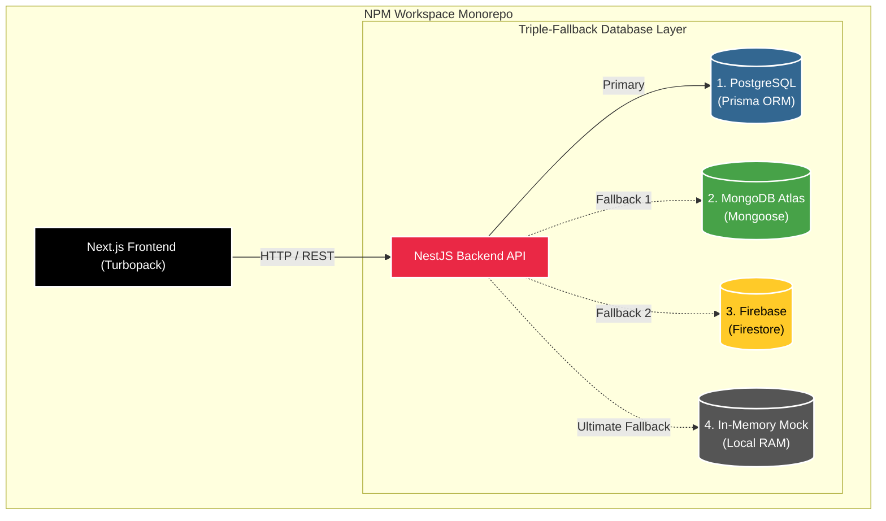

<h1 align="center">
  
</h1>

<p align="center">
  
</p>


Welcome to **ResumeAI Pro**—not just another resume builder, but a fully-fledged, AI-driven **Career Intelligence System**. 

Built with an enterprise-grade NPM Workspace Monorepo architecture (Next.js Frontend + NestJS Backend), this platform fundamentally changes how candidates optimize their profiles for the modern job market. We've bypassed the generic templates of the past and engineered an **ATS 2.0 Engine** that simulates real-world Applicant Tracking Systems to ensure maximum visibility for job seekers.

---

## ✨ Unique Features & Ecosystem

ResumeAI Pro operates across multiple specialized portals and intelligence engines:

### 🧠 ATS 2.0 Optimization Engine
- **Local Heuristics & NLP:** Simulates recruiter psychology using a completely local, rule-based Node.js NLP engine. No external APIs required.
- **8-Dimension Scoring Matrix:** Grades resumes on ATS Compatibility, Recruiter Score, Keyword Density, Industry Alignment, Executive Presence, Readability, and Business Impact.
- **Recruiter Psychology Scanner:** Simulates a human "6-second scan" to score Trustworthiness and First Impressions.
- **Impact Quantification:** Uses Regex and dictionaries to detect high-impact action verbs and parse out hard business metrics (Revenue, Cost Savings, Team Sizes).

### 🛡️ Indestructible Triple-Fallback Architecture
Our backend is engineered to survive any local development or network failure. When booting and authenticating, it gracefully cascades through:
1. **Primary Layer:** PostgreSQL via Prisma.
2. **Fallback 1:** MongoDB Atlas via Mongoose.
3. **Fallback 2:** Firebase Web SDK Cloud Firestore.
4. **Ultimate Fallback:** Secure In-Memory Mock Database.

### 💼 Comprehensive Input Ecosystem
- **Drag-and-Drop Builder:** Powered by `@dnd-kit`, allowing seamless reordering of Work Experience and Technical Projects.
- **Granular Data Collection:** Forms specifically engineered to capture Career Targets (Remote preference, Expected Salary), Certifications, and in-depth Technical Project objectives.
- **Gamification Engine:** Candidates earn XP, maintain streaks, and unlock badges to boost platform retention.

### 🏢 Multi-Role Portals & Admin Configuration
- **Terminal Admin Auth:** A breathtaking, glassmorphic login portal powered by Framer Motion. Features a "System Feature Overrides" panel for injecting external API keys securely into `localStorage`.
- **Recruiter Portal:** An AI Vector Search interface to discover top talent and post jobs.
- **College Placement Portal:** A tracking system for universities to monitor their students' hiring status.

---

## 🏗️ Architecture & Tech Stack



This project utilizes a modern **NPM Workspace Monorepo** pattern to enforce strict separation of concerns while sharing typings when necessary.

### Frontend (`apps/frontend`)
- **Framework:** Next.js 16 (Turbopack)
- **Styling:** Tailwind CSS + Framer Motion (for dynamic, liquid animations)
- **UI Components:** Shadcn/UI (Radix Primitives)
- **State Management:** Zustand
- **Assets:** `ian-xiaohei-illustrations` open-source SVGs.

### Backend (`apps/backend`)
- **Framework:** NestJS
- **Databases:** PostgreSQL (Prisma), MongoDB (Mongoose), Firebase (Firestore)
- **Intelligence:** Custom local NLP and heuristics services.

---

## 🚦 Getting Started

Follow these instructions to boot up the entire Career Intelligence System locally.

### 1. Installation
Clone the repository and install all dependencies globally across the workspace.

```bash
cd AcePath
npm install
```

### 2. Database Environment Setup
Make sure you have a `.env` file in your backend workspace containing your database credentials and API configuration overrides.

### 3. Start the Ecosystem
Our boot sequence is entirely fully-automated. Run the unified development command from the root folder:

```bash
cd AcePath
npm run dev
```

This single command will:
1. Boot the Next.js Frontend.
2. Boot the NestJS Backend.
3. Trigger an automated background webhook that seeds the Super Admin credentials (`admin` / `Admin@123`) directly into the active database layers.

- **Frontend UI:** `http://localhost:3000`
- **Backend API:** `http://localhost:3001`

---

## 🗺️ Project Roadmap

- [x] **Phase 1:** Core UI & Next.js Monorepo Setup
- [x] **Phase 2:** Smart Import & Drag-and-Drop Resume Builder
- [x] **Phase 3:** ATS Score Generation & Job Matching Dashboard
- [x] **Phase 4:** Mock Interview & AI Portfolio Generation UIs
- [x] **Phase 5:** Multi-Role Portals (Recruiter/College) & Gamification
- [x] **Phase 6:** Local ATS 2.0 Engine & Prisma Database Overhaul
- [x] **Phase 7:** Triple-Fallback DB Architecture (Postgres, Mongo, Firebase)
- [x] **Phase 8:** Animated Admin Terminal & Local Storage Configuration Injection
- [ ] **Phase 9:** Connect Frontend Zustand Forms to NestJS APIs
- [ ] **Phase 10:** Premium ATS-Safe Exports (PDF/DOCX)

---

> *"Stop building resumes. Start engineering your career."* 
> 
> — **ResumeAI Pro**
